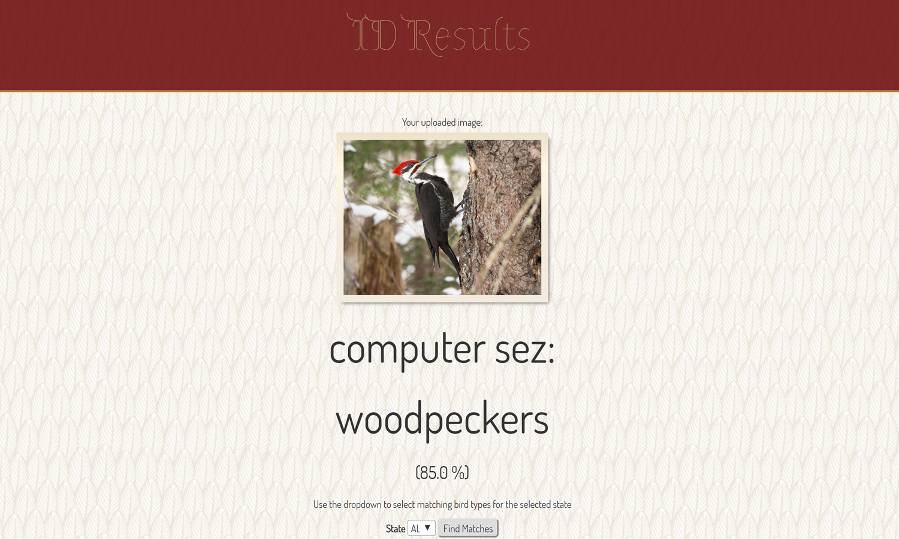

# Bird Image Classifier & Dashboard

## Machine Learning and Image Classification
This is the second iteration of Bird Oracle (see more details about the location dashboard [here](https://github.com/kblevins/ideal-adventure)). We have improved our application by integrating machine learning and image classification. We created an image classifier by building on ImageNet (a CNN based on Tensorflow).

Using this model, >15000 photographs of birds, and most of our sanity, we have created an image classification system aimed at providing users with an easy-to-use method of bird identification. Once a user uploads a bird image, our application will provide the closest match out of 44 categories of birds (owl, hummingbird, woodpecker, etc.). The user can then select the state in which the bird was observed and a list of species observed in that state along with a picture will be returned. These species also link through to the species dashboard page showing sightings of that species in the last 30 days to give the user an idea of how likely it is that they observed that species in their location.

## Additional Updates
We also made several aesthetic updates to our dashboard and included a searchable table for our users to more easily access the species search codes. 

